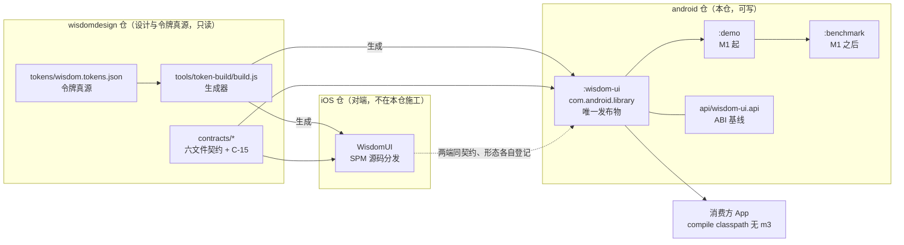
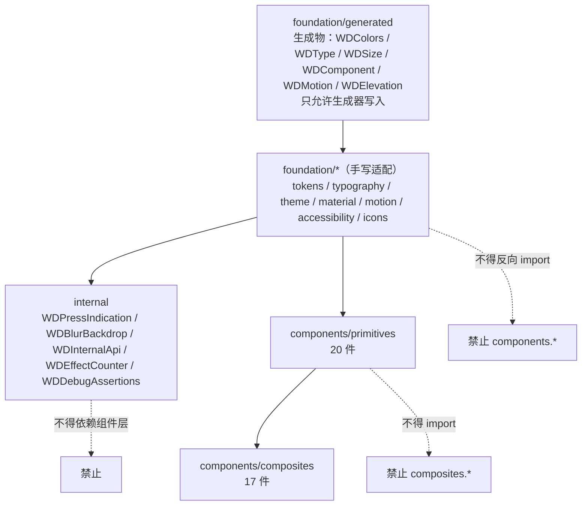
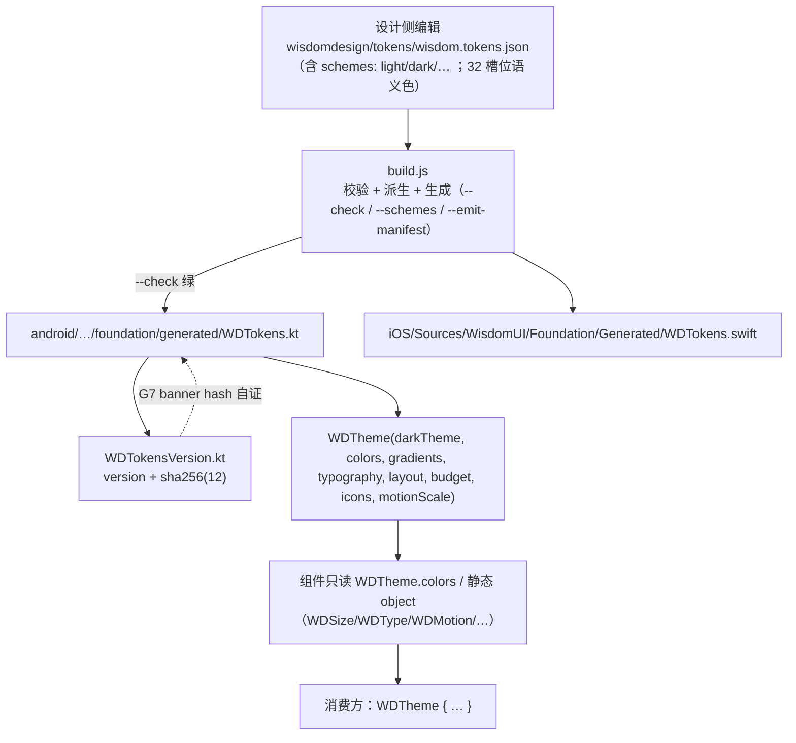
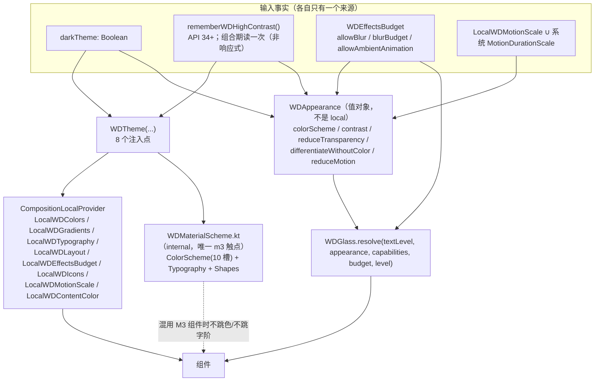
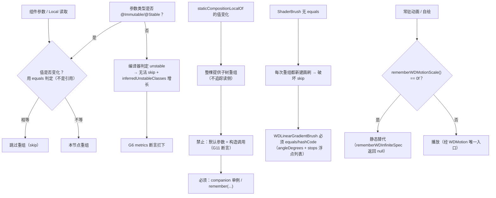
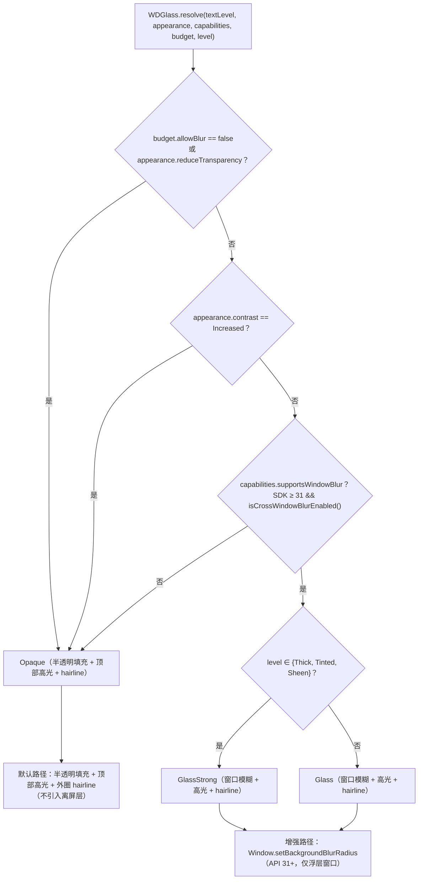
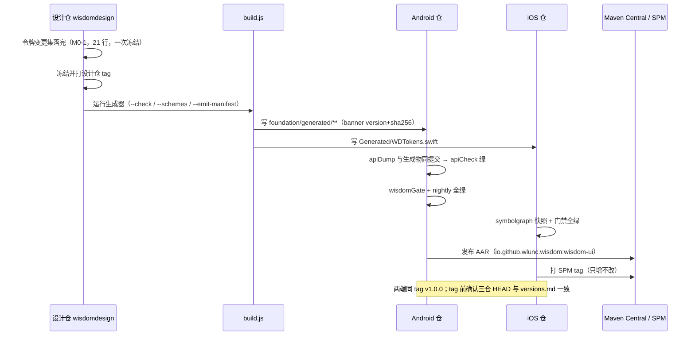

# ARCHITECTURE.md · WisdomDesign-Android 架构说明（含图表）

> **读者**：在本仓写代码的 agent、reviewer、以及需要理解"为什么这样设计"的下游（开发计划 / 发布 / 设计对接）。
> **本文件的地位**：**结构说明 + 决策记录**，不是规格。规格条文与逐条验收在 [`SPEC.md`](SPEC.md)（本端，已迁仓）、计划与批次在 [`DEV-PLAN.md`](DEV-PLAN.md)、施工入口在 [`../AGENTS.md`](../AGENTS.md)。**来源记号（迁移后）**：`07`/`08`/`20`/`21`/`27`/`30`/`40`/`61`/`63`/`66` 等数字记号属**跨端工作区文档集（已退役）**，仅作历史追溯（其结论已内联本仓或见本文件 §16）；**设计真源**位于**外部设计仓 `wisdomdesign/docs/`**（未退役；含 `01-foundation.md`、`03-perf-release.md`、`06-accessibility.md`、`12-b22-glass.md`、`09-layout.md`、`05-preview-and-theme.md` 等）——后文以**文件简称**引用。**效力顺序（冲突裁决链；与 `AGENTS.md`、iOS 两份文档同一串）**：`08`（用户决策）＞ `07`（跨端契约 U/F）＞ 本端规格 `12` ＞ `40`（只管名字，C-15 唯一表）＞ `30`（进程与冻结值口径）＞ 本端 `AGENTS`/`ARCH`。**名字冲突看 `40`、进程/冻结值冲突看 `30`**；**施工入口见 [`../AGENTS.md`](../AGENTS.md)**。
> **来源标注约定**：每条结论后给来源（`07 §x` / `08 U#` / `12 §x.y` / `30 §x.y` / `40 §x`）。凡标【未验证】的，**不得写成"已通过"**（见 §14）。
> **图表**：9 张 Mermaid（§1 / §2 / §4 / §5 / §6 / §7 / §8 / §11 / §12），其中 **§2 分层** 与 **§4 令牌流水线** 另给 ASCII 备选（便于在纯文本环境阅读）。
> **落库**：`android-lead`，2026-10-05（第一次向 `android/` 写入时落库）。

---

## 1. 系统全景：本仓在三个仓里的位置



**读图要点**

- **令牌只从 `wisdomdesign/` 流向两端**：本仓的 `foundation/generated/**` 是**生成物**，唯一写入者是 `build.js`（手改会被覆盖）。`12 §1.1.1`
- **契约六文件 + C-15 名表**由设计与架构师维护，两端只读；本仓把它落成 `contracts/<component>.yaml: params[].name` 与断言。`07 §1.5` + `40 §6`
- **`:demo` 是消费者视角的验证器**：它用与真实消费方相同的 API（禁止用 `internal`），承担真机验收、六态截图、R8 冒烟与"E2 集成 APK 差"的载体。`12 §1.2.2` + `30 §5.3`
- **对端 iOS 只通过"契约 + F 注册表"与本仓耦合**：两端实现细节允许不同，差异登记在 F 系列（§13-ADR-9）。

---

## 2. 分层与依赖方向（层包、禁循环、m3 触点 == 1）



**DEP-ASCII（等价的 ASCII 备选，便于纯文本阅读）**

```text
    foundation/generated  ──►  foundation/*（手写）  ──►  components/primitives  ──►  components/composites
             ▲                        │
             │ 只允许生成器写入         └──►  internal（工具层：不得反向依赖 components）

    禁止：foundation/** ──► components.*      （G1 的子断言 ①）
    禁止：components/primitives/** ──► components/composites.*   （G1 的子断言 ②）
    禁止：components/** 与 internal/** ──► androidx.compose.material3.*
         （**G1-③** = wisdomCheckPackageDeps 的第三条子断言；全库计数必须 == 1）
    禁止：包级循环依赖（DFS 找环，G1 的独立断言）
```

**为什么必须是机器检查而不是纪律**：单模块里 Kotlin `internal` 是**模块级**可见性，包与包之间没有墙；所以分层规则只能由脚本承担（G1 = `wisdomCheckPackageDeps`）。`12 §1.1.3`（AR-04）

> **注意（A-05）**：图中 `foundation/generated`（小写**分层目录**）是 **M0-3 提交 1 之后的目标态**；**当前实际为 `foundation/Generated/`（大写单目录）**，`WDGradient.kt`/`WDTheme.kt` 仍在 `foundation/` 根下——当前态清单见 [`../AGENTS.md`](../AGENTS.md) §1。

**m3 触点计数 == 1 的含义**：全库 `import androidx.compose.material3.*` 只允许出现在 `foundation/theme/WDMaterialScheme.kt`（唯一桥接点）。这条断言是 U4"收缩 material3、将来能拆可选 artifact"能不能成立的**唯一事实依据**：一旦计数 ≥2，拆 artifact 时删不干净。`12 §1.1.1`（AR-01）+ `08 U4`

| 层 | 包 | 允许依赖 | 关键约束 |
| --- | --- | --- | --- |
| Token 层 | `io.github.wlunc.wisdom.foundation.generated` | 仅 Compose 基础 API（`Color`/`Dp`/`TextUnit`/`SpringSpec`/`@Immutable`） | **不拆模块**：拆出去拿不到"零 Compose 依赖"的收益，只是多一层跨模块边界。`12 §1.1.1` |
| 基础层 | `…foundation.{tokens,typography,theme,material,motion,accessibility,icons}` | Token 层 + Compose | 手写适配（`toTextStyle()`、`WDGlass`、`WDSemantics`…）；m3 只在这层的 `WDMaterialScheme.kt` |
| 组件层 | `…components.{primitives,composites}` | 基础层（+ 同层 primitives） | 37 件，一组件一目录；不得出现静态令牌入口、不得碰 m3（G1/G2） |
| 内部层 | `…internal` | 基础层 | `@RequiresOptIn` 的 `WDInternalApi` + `ignoredPackages`：public 但不承诺兼容。`12 §2.9.2` |
| 构建期工具 | `android/tools/**`（不是 Kotlin 层） | — | 检查脚本必须自带反例单测（G1-③ 的 H、G2 的 I）。`12 §1.5.4` |

---

## 3. 单模块包结构与文件级树

> **⚠️ 本树是 M0-3 / M0-6 / M1 之后的「目标态」**：`generated/`（小写、含分层子目录）要等 **M0-3 提交 1**，`tools/**` 要等 **M0-6**，`demo/` 要等 **M1**。**当前实际态** = `foundation/Generated/`（大写单目录）+ 手写的 `WDGradient.kt`/`WDTheme.kt` 仍在 `foundation/` 根下，且 `tools/`、`demo/`、`benchmark/`、`.github/`、`src/debug/` 都还不存在——**当前态清单见 `AGENTS.md` §1 的边界表**。（A-05）

```text
android/
├── AGENTS.md                      ← 施工手册（先读它）
├── docs/ARCHITECTURE.md           ← 本文件
├── settings.gradle.kts            （include(":wisdom-ui")；M1 加 :demo / :benchmark）
├── build.gradle.kts               （apiValidation：nonPublicMarkers + ignoredPackages）
├── gradle/libs.versions.toml      （+ wisdom 版本键；ktlint/detekt/robolectric 首次接入时锁定）
├── tools/                         （M0-6 起）
│   ├── checks/package-graph.kt        包图 + 找环（G1 的实现）
│   ├── check-public-types.sh          G9 正向白名单
│   ├── check-release-symbols.sh       G8 正负例
│   ├── check-deprecated.sh            G4
│   ├── check-literal-language.sh      G13
│   ├── check-compose-metrics.sh       G6
│   ├── compose-metrics.init.gradle
│   ├── update-metrics-baseline.sh     G6 基线的唯一写入者
│   ├── size-report.sh                 E1/E2/E1'/F1
│   └── init-mirror.gradle             （可选镜像；不写进 settings）
├── demo/                          （M1，com.android.application；禁止用 internal API）
└── wisdom-ui/
    ├── api/wisdom-ui.api          ← ABI 基线（apiDump 生成；**当前为红**，见 AGENTS §9.3）
    ├── build.gradle.kts           （explicitApi；wisdomGate + G1–G13 任务）
    ├── consumer-rules.pro         （保持空；引入反射式 API 时要重新评估）
    └── src/
        ├── main/AndroidManifest.xml        （<manifest />，库无资源）
        ├── main/kotlin/io/github/wlunc/wisdom/
        │   ├── foundation/
        │   │   ├── generated/              ← 只允许生成器写入（**M0-3 提交 1 后的目标态**；当前为 `Generated/`，A-05）
        │   │   │   ├── WDTokens.kt              （WDColors/WDType/WDSize/WDComponent/WDMotion/WDElevation…）
        │   │   │   ├── WDTokensVersion.kt       （version + sha256(12)，与 banner 同值）
        │   │   │   └── WDIcons.kt               （**文件内类型 = `WDIconName`**；44 条语义名 + mirrorsInRTL）
        │   │   ├── tokens/                 （WDGradientBrush.kt / WDMaterial.kt）
        │   │   ├── typography/             （WDTypography.kt / WDTextMetrics.kt / WDLineHeightPolicy.kt）
        │   │   ├── theme/                  （WDTheme.kt / WDLayout.kt / WDAppearance.kt / WDEffectsBudget.kt
        │   │   │                            / WDHighContrast.kt / WDMaterialScheme.kt ← 唯一 m3 触点）
        │   │   ├── material/               （WDGlass.kt / WDGlassSpec.kt / WDGlassCapabilities.kt）
        │   │   ├── motion/                 （WDMotionScale.kt / WDHaptics.kt）
        │   │   ├── accessibility/          （WDSemantics.kt / WDTouchTarget.kt / WDAnnouncer.kt）
        │   │   └── icons/                  （WDIconSet.kt + LocalWDIcons，默认空集）
        │   ├── components/
        │   │   ├── primitives/             ← 20 件，一组件一目录（WDButton/ … /WDIcon）
        │   │   └── composites/             ← 17 件（WDBottomSheet/…/WDAssigneePicker）**无 patterns/**
        │   └── internal/                   （WDPressIndication.kt / WDBlurBackdrop.kt / WDEffectCounter.kt
        │                                    / WDDebugAssertions.kt / WDGlassBackdrop.kt）
        ├── debug/kotlin/…/components/**/*Preview.kt   ← 预览唯一物理位置（不进 release AAR）
        ├── release/kotlin/…/internal/WDDebugAssertions.kt   ← 同签名 no-op（AR-30）
        └── test/kotlin/…/{foundation,typography,components/primitives,components/composites}
            └── resources/{robolectric.properties, linebox-fixtures.json}
```

**命名与文件粒度**

| 规则 | 范围 | 来源 |
| --- | --- | --- |
| `WD` + UpperCamelCase（`WDButton`）；修饰符 `.wd` 前缀；参数 lowerCamelCase 且布尔不加 `is` | 全仓 | `12 §1.3.3` + `07 F1` |
| 一个文件一个主类型；单文件 ≤ 400 行 | **仅手写文件** | `12 §1.3.3`（AR-18） |
| 生成物豁免上述两条（单文件多类型是生成器的正确形态） | `foundation/generated/**` | 同上 |
| 组件目录名与组件同名；预览在 `src/debug` 的同相对路径 | `components/**` | `12 §1.3.3` |
| 33 个组件的完整签名按批出（M2–M6），但**受控值名一律按 C-15 先落名再冻结** | 组件层 | `40 §1`（37 行唯一表）+ `40 §5`（附注）+ `30 §3.3` |

---

## 4. 令牌流水线（tokens.json → build.js → generated → WDTheme → 组件）



**PIPE-ASCII（等价的 ASCII 备选）**

```text
  wisdom.tokens.json ──► build.js ──┬──► android/…/foundation/generated/WDTokens.kt ──► WDTheme { } ──► 组件 ──► 消费方
   （唯一真源）           │          └──► iOS/…/Generated/WDTokens.swift
                          │
                          ├── 派生：lineHeightRatio（只读属性，不是令牌字段）、
                          │         stiffness = μ·(2π/response)²（μ=1.0）
                          ├── 缺字段 emit 0（不得发明令牌外的值）
                          ├── banner：tokens vX.Y.Z · sha256:xxxxxxxxxxxx  ── 与 WDTokensVersion.sha256 同值（G7）
                          └── 目录不存在 → exit 1（禁止静默 mkdir）

  值变更的"可见性"只有一条链路：banner hash + WDTokensVersion 自证（api 文件不打印常量值）。12 §3.1.1
```

**双轨制（为什么颜色是运行时、尺寸是编译期）**

| 轨道 | 内容 | 形态 | 变更代价 | 来源 |
| --- | --- | --- | --- | --- |
| 编译期常量轨 | 间距 / 圆角 / 尺寸 / 字阶 / 动效时长 / 弹簧 / 玻璃档位参数 / 密度 / 阴影 | `object` 上的 `public val`（**非 `const`**） | 改值 = 改 AAR（发版） | `12 §3.1.1`（AR-59/AR-60） |
| 运行时变量轨 | **32** 个语义色 + 5 条渐变 | `@Immutable` 对象 + `CompositionLocal` 注入 | 换 `WDTheme(colors = …)` 或局部 provide | 同上 + `30 §5.1`（P8） |

**`const val → val` 的真实理由**：`const` 会被**内联进消费方字节码**——改令牌值后已编译的消费方不重编就永远拿旧值。`api/wisdom-ui.api` 对 `const` 与非 `const` **都不打印值**（实测：`:68-72`），所以"值变了但基线看不出来"不是 `const` 的锅；值的可见性由 banner hash 负责。`12 §3.1.1`（AR-60）

**冻结窗口只有一次**：`12 §3.1.2` 的**本端 M0-1 清单（21 行 = 17 行 (a) 令牌 + 4 行 (b) 契约）**必须在 M0-1 一次落完（**三仓合并视图见 `30 §5.5`；`02` 侧 17 行是 (a) 令牌视角的子集，粒度不同、不冲突；判据以 21 行为准**），**清单不缩表**：未给值的行标"待设计给值 + 责任人 + 时点"并按默认执行项**先冻结**，逐行记入 `versions.md` 的 deferral 表。`08 §2-1` + `30 §5.1/§2.2-②`

**两个必须一次冻结的新维度（用户决策 #3 / #8）**

1. **`schemes: {light, dark, …}` + 生成器 `--schemes`**：层一换肤 = 多套生成 scheme + 运行时选择；**不是**运行时任意 `token.json`、**不是**服务端下发。`30 §5.8`（P9）
2. **`WDColorSlot` = 32 槽位**（新增 `text.disabled`）：槽位名清单是 U12 的机器可判定形态；浅深成对。`30 §5.1`（P8）+ `user decision #3`

---

## 5. 主题 / 换肤 / 高对比度 / M3 桥接（数据流）



**读图要点**

- **`WDAppearance` 是值对象，不是第 9 个 local**：`darkTheme` + 高对比度探测在 `WDTheme` 内部得到该值，作为**参数**传给 `WDGlass.resolve`。这样避免"同一事实两个入口"。`12 §2.5`（AR-44）+ `12 §9.2-A-5`（已关闭）
- **8 个 local 全部由 `WDTheme` 一次性 provide**，且默认值必须是**单例**（`WDLayout.Comfortable`、`WDEffectsBudget.Default`、`WDIconSet.Empty`、`WDMotionScale.Normal`）——默认参数表达式**不得是构造调用**，否则 `staticCompositionLocalOf` 的值每次"变化"会引发**整树重组**（G11 断言 + §7）。`12 §2.5`（AR-45）
- **M3 桥接补齐 ColorScheme + Typography + Shapes**：只桥 ColorScheme 会导致混用场景"色对了但字阶不对"（`Text()` 读 M3 的 `LocalTextStyle`）。三者都 `remember(...)`，且**不得出现在公开签名**（G9）。`12 §3.2.3`（AR-65）
- **高对比度的三件事**：玻璃 → 不透明（走 `WDEffectsBudget.allowBlur = false`）、`border.hairline → -strong`、禁用态提高不透明度并补形状/字重差异。`rememberWDHighContrast()` 在 API 34+ 读 `isHighContrastTextEnabled()`，**组合期读一次、非响应式**（系统开关变化不触发重组，写进 KDoc 并登记 `V8`）。`12 §3.2.3`（LR-03）
- **换肤的代价与纪律**：换品牌必须先回设计仓改 scheme → 重新生成 → 发版（调用方不能自助加品牌）；**切换动作不得放进高频路径**（滚动 / 动画 / 输入回调里禁止切换主题）。`30 §5.8`
- **M3 桥接的 10 → 48 槽位**：先做现状 10 槽 + Typography + Shapes；38 个派生槽位"需要设计确认"，列入 `A-2`（M0/M1）。`12 §3.2.3`

---

### 5.1 换肤与"降低透明度"的两条设计约束（DF-16 / DF-12）

- **浅深必须成对（DF-16）**：每套 scheme **必须同时给 light + dark**，缺任一侧由 `build.js` **直接报错**（避免"深色上线才发现缺一整套值"）；**深浅冲突以浅色为准**（浅色是主交付）。口径 = `05-preview-and-theme.md`（浅深成对）+ **M0-2 生成器改造清单**（`12 §7.1-M0-2`）。
- **Android 无系统"降低透明度"开关（DF-12 / `07` F16）**：`WDAppearance.reduceTransparency` 是 **`WDEffectsBudget.allowBlur` 的只读镜像**（**不新增** `LocalWDReduceTransparency`）；设计侧"降低透明度开启 → 玻璃降级为不透明"这条验收在 Android 侧**以 budget 注入 + 单测执行**（`12 §3.2.3`）。

## 6. 组件模型：槽位、Modifier 顺序、状态机、`interactionSource`

### 6.1 槽位规则（U3）

| 规则 | 内容 | 来源 |
| --- | --- | --- |
| 单槽命名 | `content` | `12 §2.4` |
| 多槽语义名 | `header` / `footer` / `leadingIcon` / `trailingIcon` / `leading` / `trailing`（21 名共享词表） | `12 §2.4`（U3） |
| 无槽位 | **必须显式写"无"**（契约 37 行逐行登记） | 同上 |
| 槽位可空性 | 规格写"可选" → `(@Composable () -> Unit)? = null`；写"必有" → 非空参数 | 同上 |
| receiver | 只有真需要 `Modifier.weight` 才用作用域槽（`RowScope` 会进 ABI：`Function1<RowScope, Unit>`） | 同上 |
| 子组件 | 复合组件内的固定结构**不走槽位**（是组件自己的布局） | 同上 |
| 图标 | 一律走槽位或注入：`leadingIcon: (@Composable () -> Unit)?` + `WDIcon(imageVector=…)`（库内零图标资源） | `08 U8` + `12 §2.4` |

### 6.2 `Modifier` 顺序（**固定链，顺序错就断言红**）

```kotlin
// 组件内部链（由上到下 = 由外到内）：
//   [调用方 modifier] . wdTouchTarget() . clickable(interactionSource, indication, enabled, role, onClickLabel, onClick)
//                     . clip(shape) . background/glass . padding(内距) . [内容]
```

| 位置 | 为什么在这里 | 违反后果 | 来源 |
| --- | --- | --- | --- |
| 调用方 `modifier` **最外层** | 调用方决定"占多大、离邻居多远" | 组件自说自话，与外层布局打架 | `12 §2.5`（M1/M2/M6） |
| `wdTouchTarget()` 紧跟其后 | 扩热区**不放大视觉**、**不越界到相邻行** | "`Sm` 档视觉 32 / 热区 48"断言必红 | `12 §2.5`（L7 + 案 B） |
| `clickable` 在 `clip`/`padding` **之前** | 否则热区被 padding 缩回视觉尺寸 | 同上（LR-23） | `12 §2.5` |
| `clip`/`background` 在 `padding` 之前 | 背景铺满热区，内距只影响内容 | 背景被内距切掉一块 | `12 §2.5` |

**`Modifier.wd*` 允许清单（6 条，且规定谁读 local）**：`wdTouchTarget`（自研 `layout`，零 m3）、`wdGlass(level)`（**只接参数**，解析在组件体内）、`wdMergedRow()`、`wdLabelledBy(label)`、`wdLiveRegion(stateDescription)`（顶层函数）、`wdSystemGestureExclusion()`（**只允许 drag handle 调用，G12 断言调用点 == 1**），另有 internal 的 `wdDialogImePadding()`（只允许弹层组件）。**不为读主题写 `Modifier.composed { }`**（`07 §1.4` 反模式 2）。`12 §2.5`（AR-43）

### 6.3 状态机与优先级（U6）

```mermaid
stateDiagram-v2
    [*] --> Default
    Default --> Hover: 指针进入（指针设备）
    Hover --> Default: 指针离开
    Default --> Focused: 键盘/读屏聚焦
    Focused --> Default: 失焦
    Focused --> Pressed: 空格/回车按下
    Pressed --> Loading: 触发 onClick 且调用方置 loading=true
    Default --> Pressed: 手势 down
    Pressed --> Default: 手势 cancel 或 up
    Loading --> Default: 调用方复位 loading=false
    Default --> Disabled: enabled=false
    Hover --> Disabled: enabled=false
    Focused --> Disabled: enabled=false
    Pressed --> Disabled: enabled=false
    Loading --> Disabled: enabled=false
    Disabled --> Default: enabled=true
    note right of Disabled
        最高优先级：吞输入；
        点击/键盘都不再触发 onClick
    end note
    note right of Loading
        忽略 action（计数必须 == 0），
        但仍留在无障碍树（stateDescription = loadingLabel）；
        不用 enabled=false 表达 loading
    end note
```

> **U6 全序串（必须统一，逐字照抄）**：`disabled > loading > pressed > focused > hover > default`；下面是三条派生规则（可断言）。验收 = **同一串输入 → 同一可见状态**（两端单测）。

**三条派生规则（可断言）**

| # | 规则 | 落点 | 断言 |
| --- | --- | --- | --- |
| 1 | **disabled 最高且吞输入** | `clickable(enabled = enabled, …)`（`disabled()` 语义由 `clickable` 自带，**不手写**） | `assertIsNotEnabled()` |
| 2 | **loading 忽略 `action` 但留在无障碍树** | `clickable(enabled = enabled, onClick = { if (!loading) … })` + `semantics { if (loading) loadingLabel?.let { stateDescription = it } }` | `loading` 期间 `action` 计数 == 0（U16）；`hasStateDescription("处理中")` |
| 3 | **focused / hover 是叠加维度** | 与 pressed 同层叠加（各算各的，最后合成） | 同一串输入 → 同一可见状态 |

**`interactionSource` 是按下态的唯一来源**（F6/INT-1/C14）：组件只有一个 `MutableInteractionSource`，参数**必须可空**（默认参数表达式不在 Composable 上下文求值，内部 `interactionSource ?: remember { … }`）；**禁止** `pointerInput` 自造按下态、**禁止**第二个按下源、**禁止**覆写 `LocalIndication`。`12 §2.2①` + `12 §2.6.2`

**按下反馈的视觉实现**：`WDPressIndication`（`IndicationNodeFactory` 单例，保留水波）负责涟漪；"亮度 96%"由**叠加一层带 alpha 的 `fillPressed`** 实现（`drawWithContent { drawContent(); drawRect(WDTheme.colors.fillPressed.copy(alpha = WDComponent.pressOverlayAlpha)) }`）；**禁止** `ColorMatrix` / `renderEffect` / `graphicsLayer.alpha` 三条（离屏层与对比度账目）。`12 §2.6.2`（AR-47/AR-48）

---

## 7. 渲染、重组与降级决策



**这一节的四条硬规则**

| # | 规则 | 为什么 | 谁拦 | 来源 |
| --- | --- | --- | --- | --- |
| 1 | 参与 Compose 参数的值类型必须 `@Immutable`/`@Stable`（全量清单见 `12 §2.9.1`） | 稳定性是"允许跳过"的许可；跨模块消费方尤其敏感 | **G6**（`inferredUnstableClasses == 0`，文件缺失即 fail）+ **G5**（`$stable` 存在性） | `12 §2.9.1`（AR-57） |
| 2 | `staticCompositionLocalOf` 的值必须**单例或 `remember`**；默认参数不得是构造调用 | 值变化 = 整树重组；这是"看起来能跑、实际掉帧"的典型 | **G11** | `12 §2.5`（AR-45 / B7） |
| 3 | `ShaderBrush` 系（`WDLinearGradientBrush`）必须值等（`angleDegrees` + `stops`） | `ShaderBrush` 无 `equals` → 不相等 → 无法 skip | 单测 + G6 | `12 §2.8.3` |
| 4 | 属性动画自动尊重系统缩放，**不得**重复判断；只有常驻/自绘动画经 `WDMotion` | 双重降级 = 动画被压两次 | review + 单测 | `12 §2.8.4` + `12 §3.5.2` |

**`WDMotion` 是唯一入口**：`rememberWDMotionScale() = LocalWDMotionScale × 系统 MotionDurationScale`（机制已由字节码确认：平台实现持 `MutableFloatState` 并注册 `ContentObserver`，读它会订阅重组）；`scale == 0f` 时 `rememberWDInfiniteSpec()` 返回 `null`，调用方**必须画静态替代**（禁止 `?: return`）。`12 §3.5.2`（AR-56）+ `11 §0.1-E7`

---

### 7.1 减弱动态的"显示静态"四类点名（DF-09）

设计侧是一张 7 行降级表（`06-accessibility` §6）；只写"常驻动画 → 静态"会漏掉下面**四类**（它们正是视觉评审会看的地方）：

| 开启动画减弱后 | 本仓落点 |
| --- | --- |
| **`material.sheen` 高光扫过 → 停止** | 经 `WDMotion`；`rememberWDInfiniteSpec() == null` |
| **骨架微光 → 停止**（显示静态灰块） | 静态灰块（配额 4：同屏 ≤6 / 减弱即静态） |
| **进度环旋转 → 停止**（显示静态进度） | `WDMotion` + 静态弧（配额 6） |
| **下拉刷新旋转环 → 改为静态环** | 同上 |
| 弹簧 → 线性 150ms；位移/缩放 → 交叉淡入淡出；页面转场 → 直接切换（归宿主） | `motion.duration.reduced = 150` + `WDMotion` |

## 8. 玻璃三路降级（P-1 + U10）



**读图要点**

- **判定顺序是唯一的实现点**，四步可单测：① `allowBlur=false` 或 `reduceTransparency` → `Opaque`；② `contrast=Increased` → `Opaque`；③ 无窗口模糊能力 → `Opaque`（minSdk 24 的多数设备走这条）；④ 否则按档位给 `Glass` 或 `GlassStrong`。`12 §3.5.3`

**U10 的类型名（两端同列同名，禁止自造；XR-08）**：**输出 = `WDGlassResolution{Opaque, Glass, GlassStrong}`**；**必选输入 = `WDTextLevel{Primary, Secondary, Tertiary}` + `WDAppearance` + `WDGlassCapabilities` + `WDEffectsBudget`**；**Android 额外输入 = `WDGlassLevel{UltraThin, Thin, Regular, Thick, Tinted, Sheen}`（F47，不写进 U10 的 Inputs 句）**。上图中的 `Opaque`/`Glass`/`GlassStrong` 都是该枚举的 **case 名**；历史名 `WDGlassEffective` **已作废**（`12 §3.5.3`）。
- **组件不得自己选档**（U10）：组件只传 `glass`（设计意图档位）与 `textLevel`，实际生效档由 `WDGlass.resolve` 决定。`07 U10` + `12 §3.5.3`
- **能力位不能只看 SDK_INT**：`supportsWindowBlur = SDK_INT >= 31 && windowManager.isCrossWindowBlurEnabled()`（省电模式会关掉跨窗模糊）；窗口需带 `FLAG_BLUR_BEHIND`，且只用于浮层窗口。`12 §3.5.3`（AR-66）
- **库内禁用 `Modifier.blur` 充当背景模糊**：它模糊的是自身内容而不是背后内容（`docs/03-platform-mapping.md:206`）。`08 §2-6`
- **配额是可测 API**：`WDEffectsBudget(allowBlur, blurBudget, allowAmbientAnimation)` 是输入；`rememberWDEffectSlot(kind)` 是内部计数（超预算返回 false）；单测 = "同屏 7 个 `WDSkeleton` → 第 7 个走静态灰块"。`12 §3.5.3`（AR-74）

---

### 8.1 玻璃六档 → 语义档 → 文字可用（设计规则，DF-02）

**六档是设计真源**（`wisdomdesign/docs/01-foundation.md` §7.2）：`ultraThin 14/.38`、`thin 22/.54`、`regular 30/.70`、`thick 44/.86`、`tinted`（品牌染色 24–30%）、`sheen`（3800ms 高光扫过）。**消费层只有两档语义值**，且必须逐位等于 `regular`/`thick` 的空填充（`12-b22-glass.md` §3 的两条生成期断言：`surface.glass ≡ material.regular`、`surface.glass-strong ≡ material.thick`）。

| 设计档位 | 语义档 | 允许文字（**最不利口径**，`06-accessibility` §5.2） | 本仓落点 |
| --- | --- | --- | --- |
| `ultraThin`/`thin`/`regular` | `surface.glass` | 浅色端**只放 `primary`**（8.4:1 ✅；`secondary` 3.6 ❌、`tertiary` 3.1 ❌）；**深色端不上任何字阶**（`primary` 4.1 ❌） | `WDGlassLevel.{UltraThin,Thin,Regular}` → `Glass` |
| `thick` | `surface.glass-strong` | 浅色端三级全可用（12.7/5.5/4.7 ✅）；**深色端只放 `primary`**（7.2 ✅；`secondary` 4.2 ❌、`tertiary` 2.9 ❌） | `WDGlassLevel.Thick` → `GlassStrong` |
| `tinted` | —（强调容器） | **不作文字载体**：品牌染色 Hero 卡 / 选中态容器 | `WDGlassLevel.Tinted` 保留语义，**不得并进 `GlassStrong`** |
| `sheen` | —（装饰） | **不作文字载体**：3800ms 动态高光 | `WDGlassLevel.Sheen` 保留语义，**不得并进 `GlassStrong`** |

**四条文字规则**（照抄 `06-accessibility` §5.2 规则 1–4）：① 浅色 `glass` 只放 `primary`；② **深色端任何字阶不上 `glass`**，`glass-strong` 只放 `primary`；③ **悬浮 Tab 栏必须 `glass-strong`**，且**深色端 Tab 栏改用不透明表面**（`surface.card-solid` + 顶部高光 + 外圈细线 = `12-b22-glass.md` §7 **方案 A**）；④ **语义色（`status.*`）不上玻璃**。

> **图注更正（DF-02）**：上图第 ④ 步的 `level ∈ {Thick, Tinted, Sheen} → GlassStrong` 只表达**可读性结论**（三者都给强底）；`Tinted`/`Sheen` 的**档位语义**（品牌染色 / 动态高光）与上面的文字规则一起由 [`../AGENTS.md`](../AGENTS.md) **§6.1.1** 锁定，**不得**当成 `Thick` 的同义档。

### 8.2 效果配额 7 条与对比度门槛（DF-03 / DF-04）

| # | 效果 | 硬上限（`03-perf-release.md` §1.2） | 本仓违反时的行为 |
| --- | --- | --- | --- |
| 1 | 玻璃模糊面 | **同屏 ≤1；列表项内 0** | `allowBlur=false` → `Opaque`；列表项不申请槽 |
| 2 | 色晕 `wash` | 每屏 1 处；**禁止动画** | 一次绘制画 3 段 radial brush；第二处不画 |
| 3 | 高光 `sheen` | 每屏 ≤1，仅强调卡片 | 离屏/后台必须停；`reduceMotion` → 停 |
| 4 | 骨架微光 | **同屏 ≤6**，仅加载态 | 第 7 个起静态灰块（单测已固化） |
| 5 | 阴影 `elevation` | 列表项 `e0`/`e1`；`e3` 每屏 ≤1 | 超出降到 `e1`；禁止离屏层 |
| 6 | 进度 / 下拉环 | **每屏 ≤1 个动画环** | 其余静态弧；`reduceMotion` → 静态 |
| 7 | 触觉 | **同一次操作 1 次** | 高频交互（`WDStepper` 长按）不给触觉 |

**对比度硬门槛**（`06-accessibility` §5.1）：正文 **4.5:1**、大字号 **3:1**、图形/图标/控件边界 **3:1**、禁用态**不适用但需可辨识（40%）**、焦点光环 **3:1（对相邻色）**；**验收取最不利位置的背景色**（玻璃取最暗/最亮内容合成色，§5.2 规则 6）。高对比度开关 = **API 34+**（`<34` 恒 `Standard`），`contrast=Increased` 走第 ② 步 → **`Opaque`**。

> **上游条文与指针**：可勾选的条文集中在 [`../AGENTS.md`](../AGENTS.md) **§6.1**（玻璃矩阵 / 配额 7 条 / 对比度门槛）；规范来源 = 设计侧仓内文档复核（已退役） **§3 的 DF-02 / DF-03 / DF-04**，落地出口登记在 `DEV-PLAN.md` **§7**（`t56`；以 DEV-PLAN 现文为准）；设计侧待给值 16 项见 `63` **§4**（本文件不复抄）。


### 8.3 密度档三条附带规则（DF-05）与设计待给值指针

**数值之外的规则**（照抄 `wisdomdesign/docs/09-layout.md` §4）：① **compact 不让文字变小**——只压缩留白（字号阶梯不随密度档变化）；② **同一屏不混用两档**（`WDLayout` 单屏唯一实例；`LocalWDLayout` 只给一档）；③ **含表单 / 含破坏性操作的页面一律 `Comfortable`**（紧凑会抬高误触率）。

**设计待给值随令牌走（DF-17 / F-05②）**：三张阶梯（**圆角 / 间距 / 字号**）与**图标尺寸·线宽阶梯**等未给值项**不在此展开**，随 **M0-1 令牌冻结**一起落库——清单与责任人见 `DEV-PLAN.md` **§7**（含 §7.1 的 21 行现值）；本文件只保留"随令牌走"这一口径。

## 9. 无障碍语义与焦点
### 9.1 语义槽位（十维）与落点

| 维度 | Android 落点 | 例外 / 备注 | 来源 |
| --- | --- | --- | --- |
| 名称 | `contentDescription` / `Modifier.wdLabelledBy(label)` | `WDTextField` **不设** `contentDescription`（会顶掉"编辑框"角色与内容回读） | `12 §2.6.3`（A-2） |
| 值 | `stateDescription`（空安全写入：`loadingLabel?.let { … }`） | loading 文案走"值"，不塞进 label | 同上（AR-49） |
| 禁用 | 由 `clickable(enabled = false)` **自带**（不手写 `disabled()`） | 若实测未带语义，补在 `WDSemantics` 单点 | 同上 |
| 角色 | `Role`：**恰好 9 个取值**（`Button`/`Checkbox`/`Switch`/`RadioButton`/`Tab`/`Image`/`DropdownList`/`ValuePicker`/`Carousel`） | **无容器角色**；`WDSlider` 走 `progressBarRangeInfo` + `setProgress`，不写 `Role`；反射单测锁定取值集合 | `12 §2.6.3`（LR-16） |
| 容器 | `isTraversalGroup + collectionInfo` / `paneTitle + dialog()` | 容器的"近似规则"进契约 | `12 §2.6.3`（A-1） |
| 播报 | `Modifier.wdLiveRegion(stateDescription)` + `WDAnnouncer` | `liveRegion` 与 `announce` 二选一，避免读两遍 | `12 §3.6.5` |
| 进度 | `progressBarRangeInfo` | 只跨 25/50/75/100% 时播报 | `12 §3.6.1` |
| 焦点 | `focusRequester` / `focusRestorer` | 实验 API 只在 `foundation/accessibility/` 收口一次 opt-in | `12 §3.6.2` |
| 装饰 | `clearAndSetSemantics {}` | 装饰不进树（`WDDivider`、`WDAvatarStack(count=0)`） | `12 §2.7` |
| 排序 | 视觉阅读顺序 = 焦点顺序；列表整行一个焦点 | FAB/Toast 不抢焦点但**保留在语义树** | `12 §3.6.2` |

### 9.1a 对比度门槛与"最不利"口径（DF-04）

| 内容 | 下限 | 口径 |
| --- | --- | --- |
| 正文（< 18.66pt 粗体 / < 24pt） | **4.5:1** | **取最不利位置的背景色**，不取平均；玻璃 / 半透明底取**最暗或最亮内容的合成色** |
| 大字号（≥ 18.66pt 粗体） | **3:1** | 同上 |
| 图形、图标、控件边界 | **3:1** | 轨道 / 描边 / 进度填充同样适用 |
| 禁用态 | 不适用（可辨识即可） | 40% 不透明度（`state.*` 令牌族） |
| 焦点光环 | **3:1（对相邻色）** | `text.brand` 18–32% 叠加 |

**玻璃上的已知不达标组合**（`06-accessibility` §5.2，推导 `12-b22-glass.md` §4）：浅色 `glass` 上 `secondary` 3.6 ❌ / `tertiary` 3.1 ❌；**深色 `glass` 连 `primary` 也只有 4.1 ❌**；深色 `glass-strong` 上 `secondary` 4.2 ❌ / `tertiary` 2.9 ❌。⇒ **深色端不上玻璃**不是风格选择，而是对比度硬门槛（见 §8.1 的四条文字规则）。
**高对比度**：`rememberWDHighContrast()`（**API 34+**；**`<34` 恒 `Standard`**）→ `contrast=Increased` 时玻璃一步降为 `Opaque`（§8 第 ② 步）。
**验收**：nightly 自算对比度（`12 §1.5.6`）+ 每套 scheme 的账目进 `contracts/contrast.json`（`30 §5.8` 出口判据）；`30 §5.9` 的 `D-13` 为待设计给值项，**未给值前不得写"已验证"**（§14.1）。


### 9.2 焦点与弹层
- 弹层：焦点进入并限制在内；关闭后**归还触发元素**（库内 `wdFocusRestorer()` 收口一次 `@OptIn(ExperimentalComposeUiApi::class)`）。`12 §3.6.2`
- **禁止**用 `FocusRequester` 在 `LaunchedEffect` 里抢焦点（会打断读屏流）；只允许在"弹层出现"这类明确事件上请求。`12 §3.6.2`
- `WDBottomSheet` 的 back 由 `Dialog` 窗口默认行为覆盖（`dismissOnBackPress = true`）→ `onDismissRequest`，并断言"back 不重复触发"；**不引 `activity-compose`**。`12 §3.4.2`

### 9.3 热区（自研 `layout` 修饰符，零 m3）

```kotlin
public fun Modifier.wdTouchTarget(minSize: Dp = WDSize.touchTargetMin): Modifier =
    this.layout { measurable, constraints ->
        val min = minSize.roundToPx()
        val p = measurable.measure(constraints)
        val w = maxOf(p.width, min).coerceAtMost(constraints.maxWidth)
        val h = maxOf(p.height, min).coerceAtMost(constraints.maxHeight)
        layout(w, h) { p.place((w - p.width) / 2, (h - p.height) / 2) }
    }
```

| 事实 | 说明 | 来源 |
| --- | --- | --- |
| 为什么自研 | `defaultMinSize` 只改传给子节点的约束，内层固定尺寸（视觉 32/44）时**失效**；`minimumInteractiveComponentSize()` 会把全库 m3 触点变成 2 个（U4 破产） | `12 §3.6.3`（AR-66）+ `11 §0.1-E1/E2` |
| 令牌双键 | Android `WDSize.touchTargetMin = 48.dp`（iOS 44）；**一次性改名、不留过渡键**；不得用它做视觉尺寸 | `08 U8` |
| 行的"热区即行高" | **案 B**：行**布局盒 = 48 = 44 可见内容 + 上下各 2dp 透明内边距**；热区 = 布局盒、**不与相邻行重叠**。**指针：`F51` = 列表行距差异（Android 48 / iOS 44），U = 两端可见内容 44 ± 0.5** | 用户决策 #2 + `30 §5.5/§5.9`（**F51** / P7） |
| 与 `LazyColumn` | 自研实现不改变视觉尺寸，因此不产生"扩热区吃相邻行"；实测项 = `V9` | `12 §9.1-V9` |
| 动态字体 | `sp` 自动缩放 + `TextStyle.lineHeight`（总盒高）+ `LineHeightStyle.Mode.Minimum`；行盒 = `max(设计值×缩放, 自然行高)`；**禁止** `Mode.Fixed`/`lineHeightMultiple`/`@ScaledMetric` | `08 §2-2` + `12 §3.6.4` |

---

## 10. i18n 与 RTL

| 项 | 规则 | 来源 |
| --- | --- | --- |
| L-B（库内零资源零文案） | 无 `res/`、无字体、无 `strings.xml`；文案与图标都来自调用方；`WDIconButton(contentDescription)` / `WDButton(text)` 由签名保证必填 | `08 §2-4/2-5` |
| 拼接帮助函数 | `WDSemantics.join(separator, vararg parts)`：**分隔符与词序由调用方传**，库内**不得**有默认分隔符或"第 n 项，共 m 项"这类模板；与 iOS 同批（iOS 初稿曾内置全角逗号） | `12 §3.7.2`（D5/AR-84） |
| 复数 / 性别 | 库不处理（L-B 的推论）；调用方用 App 侧 `plurals` 或格式化后传入；M0 语言清单 `zh-Hans` + `en`（`ar` 仅作 RTL 验证语言） | `08 U9` + `12 §3.7.3` |
| 日期 / 数字 | 库内**禁止** `String.format` / `SimpleDateFormat` / `NumberFormat` / `DateTimeFormatter`；一律调用方格式化后传入；12/24 制与补零以平台 locale 为准 | `12 §3.7.3` |
| RTL 布局 | `start/end` 而非 `left/right`；禁 `absolute*`；`TextAlign.Start/End` | `12 §3.7.3` |
| RTL 图标镜像 | **以 `ImageVector.autoMirror` 为准**；`mirrorsInRTL` 是**语义标记**，不是实现指令；只在 `Rtl && mirrorsInRTL && !autoMirror` 时兜底画镜像层；**禁止**无条件 `Modifier.scale(-1f)`（会与 `autoMirror` 双重镜像 = 看起来没镜像） | `12 §3.7.3`（AR-76） |
| RTL 渐变 | **不镜像**（CSS 角度口径；契约里写成显式断言，登记 F40） | `12 §3.7.3`（AR-77） |
| 预览验证 | `@Preview(locale = "ar")` 作为 RTL 验证档 | `12 §1.6.2` |

---

## 11. 门禁与 CI 拓扑（`wisdomGate` 与 G1–G13）

```mermaid
flowchart TD
    PR["PR / 本地"] --> GATE["wisdomGate（复合任务）"]
    PR --> DIFF["apiDump && git diff --exit-code<br/>（shell，Gradle 无法表达 git 语义）"]

    GATE --> T1["apiCheck"]
    GATE --> T2["assembleRelease / assembleDebug"]
    GATE --> T3["testDebugUnitTest"]
    GATE --> G1["G1 wisdomCheckPackageDeps<br/>方向 + 无环 + m3 计数 == 1"]
    GATE --> G2["G2 wisdomCheckTokenLiterals"]
    GATE --> G3["G3 wisdomCheckMainNoPreview"]
    GATE --> G4["G4 wisdomCheckDeprecatedBaseline"]
    GATE --> G5["G5 wisdomCheckStabilityFields"]
    GATE --> G6["G6 wisdomCheckComposeMetrics"]
    GATE --> G7["G7 wisdomCheckGeneratedSelfProof"]
    GATE --> G8["G8 wisdomCheckReleaseSymbols（正负例）"]
    GATE --> G9["G9 wisdomCheckPublicTypes（正向白名单）"]
    GATE --> G10["G10 wisdomCheckInsetsWhitelist"]
    GATE --> G11["G11 wisdomCheckThemeDefaults"]
    GATE --> G12["G12 wisdomCheckSingleCallSite"]
    GATE --> G13["G13 wisdomCheckLiteralLanguage（M0–M2 warning）"]
    GATE --> LINT["ktlintCheck / detekt / lintRelease"]

    NIGHT["nightly（只报不拦 → M4 起 B1/B2/E2 转门槛）"] --> SC["六态截图 + WDLineBoxTest + 对比度 + 大字号矩阵"]
    NIGHT --> R8["demo:assembleRelease（R8 冒烟 + seeds 存档）"]
    NIGHT --> PERF["Benchmark：B1/B2/A2/A3/E2"]
    REL["发布前（阻塞发布）"] --> SIZE["集成 APK 差 + apkanalyzer dex + POM 三查 + tag 校验"]
```



| 层 | 本仓命令 | 属性 |
| --- | --- | --- |
| PR 必过（目标 ≤10 min / warm ≤5 min；**目标值不是实测值**） | `./gradlew wisdomGate` + `./gradlew :wisdom-ui:apiDump && git diff --exit-code -- wisdom-ui/api/wisdom-ui.api` | 阻塞合并；批内每日至少一次，批出口前必须全绿 |
| nightly | 见上图 | M1–M3 只报；**M4 起 B1/B2/E1（= 本仓 E2）转门槛**（`08 U3`） |
| 发布前 | 见上图 | 阻塞发布（M4 冒烟 / M6 正式） |

**门禁设计的三条原则**

1. **能机器判定的优先机器化**，落不到命令的规则一律降级为 KDoc 说明（M0 里"metrics 断言只写了一行注释"就是反面教材，已修成真实 task）。`12 §1.5.3`（B5）
2. **G2 的符号级白名单**（`AGENTS.md` §10 第 1 行只留指针）：只允许 `WDSize.*` / `WDRadius.*` / `WDSpacing.*` / `WDComponent.*` / `WDMotion.*` / `WDType.*` / `WDElevation.*`；`.dp` / `.sp` / `ms` 裸字面量一律 fail。
3. **自研检查必须能被自己测红**：G1-③ 有反例单测 H（造第二个 m3 import → 断言失败，删掉 → 恢复绿），G2 有反例单测 I（临时文件写裸值 → 失败；放进 `generated/` → 通过）。`12 §1.5.4`
3. **单测只跑 debug 变体**（`testDebugUnitTest`）：Compose 本地测试需要 `ui-test-manifest` 进 debug 变体，screenshot 插件也只支持 debug；`release` 路径由 `assembleRelease` + `:demo:assembleRelease`（R8）覆盖。`12 §1.2.2`（B6）

---

## 12. 版本与发布时序



**纪律**

- **发布顺序不可颠倒**：令牌冻结并打设计仓 tag → 生成 → 两端提交（含 `apiDump`/符号快照）并全绿 → 两端打 tag。`07 §2.2-REL-5`
- **tag 只增不改**：禁止 move / delete / re-tag；打错版本只能发新版本并在 CHANGELOG 标注废弃版本号。`07 §2.2-REL-5`
- **三层版本不混用**：令牌数据（`tokens` 变更集）→ 组件契约（`contracts/`）→ 库版本（`wisdom`，`-Pwisdom.version` > 环境变量 > catalog）。`07 §0-8` + `12 §1.2.1`
- **`$default` 规则**：给既有 public 函数加带默认值的参数 = 二进制不兼容（`$default` 合成方法签名变化）→ major 或新增重载；CI 用 `$default` 计数比对。`12 §2.9.3`

---

## 13. ADR 摘要（架构决策记录）

| # | 决策 | 结论 | 被否方案与理由 | 来源 |
| --- | --- | --- | --- | --- |
| ADR-1 | 仓库形态 | 三仓 + 令牌包化（不搬 monorepo） | monorepo 的"SPM 子目录"论据不成立；真正要修的是跨仓写入 | `08 U1` |
| ADR-2 | 模块形态 | 单模块 `:wisdom-ui` + `:demo`/`:benchmark`；**不拆 token 模块** | 生成物直接引用 Compose 类型，拆出去拿不到"零 Compose 依赖"收益 | `12 §1.1.1` |
| ADR-3 | 分层强制手段 | 机器检查 G1（方向 + 无环 + m3 计数 == 1） | "靠纪律"不可行：单模块内 `internal` 是模块级，包间无墙 | `12 §1.1.3` |
| ADR-4 | 令牌真源形态 | `lineHeight` 保留**绝对值** + `letterSpacing` 槽位 + 生成物派生只读 `lineHeightRatio` | "令牌只存 ratio"会把设计整数变浮点、且 iOS 仍要依赖 `UIFont.lineHeight` | `07 §2.2-D`（TYP-1） |
| ADR-5 | 弹簧 canonical | `response` + `dampingRatio`；`stiffness = μ·(2π/response)²`，**μ = 1.0** | 禁用 `massFactor`；量纲问题已双向闭合（两端同一物理量） | `08 U10` + `08 §2-3` |
| ADR-6 | 行高与热区 | **可见内容 44 两端同值**；Android 布局盒 48（44 + 上下各 2dp 内边距） | 单端把 `compact` 视觉做成 48 会破设计；扩热区吃相邻行不可接受 | 用户决策 #2 + `30 §5.9` |
| ADR-7 | material3 依赖面 | 收缩为 `implementation` + BOM 留 `api` + 公开签名不得出现 m3 类型（G9）+ **m3 import 计数 == 1** | 体积收益 = 0 直到拆 artifact，但"消费方不被绑 m3 版本"立即成立 | `08 U4` + `12 §1.2.3` |
| ADR-8 | 触控热区实现 | **自研 `layout` 修饰符**（零 m3） | `minimumInteractiveComponentSize()` 会成为第二个 m3 触点；`defaultMinSize` 在内层固定尺寸时失效 | `12 §3.6.3`（AR-66） |
| ADR-9 | 两端自由项登记 | F 系列（真源 = `20` 的 F 注册表）；两端形态两列齐全才允许进 `contracts/README.md` | "各自决定"会让差异不可追溯 | `07 §1.1` + `12 §4.1` |
| ADR-10 | 无障碍网关 | `WDHaptics`/`WDAnnouncer` = `interface` + `remember*()` + 可注入 local（默认 = 平台实现） | 原稿的 `@Composable fun press()` 无法在 `onClick` 里调用；无 Context 的 object 无法播报/无法注入捕获器 | `12 §3.6.5`（AR-75/B2） |
| ADR-11 | 图标 | 契约统一 44 条语义名 + `mirrorsInRTL`；Android 调用方注入 `ImageVector`（库内零资源） | 打包 drawable 破坏"库内零资源"；`material-icons-extended` 被禁 | `08 U8` + `07 §2.1-D-3` |
| ADR-12 | 换肤 | **层一**：多套生成 scheme + 运行时选择；不支持运行时任意 `token.json`/服务端下发；切换不进高频路径 | 运行时任意覆盖会破坏"令牌是唯一真源"与对比度账目 | 用户决策 #8 + `30 §5.8` |
| ADR-13 | 单测变体 | PR 只跑 `testDebugUnitTest` | Compose 本地测试需 debug 变体；screenshot 插件只支持 debug；release 由 R8 冒烟覆盖 | `12 §1.2.2`（B6） |
| ADR-14 | 玻璃 | 默认降级（半透明填充 + 高光 + hairline）；窗口模糊为可选增强（API 31+ 且 `isCrossWindowBlurEnabled()`，仅浮层） | `Modifier.blur` 不是背景模糊；离屏层与配额冲突 | `08 §2-6` + `12 §3.5.3` |
| ADR-15 | 库内资源 | **零资源零文案**（L-B）；文案/图标全部调用方传入 | 资源容器会破坏零依赖基线，并给 37 个组件加查表成本 | `08 §2-4/2-5` |

---

## 14. 未闭合项与风险（**不得写成"已通过"**）

### 14.1 未闭合验证项（与本仓相关，完整表见 `12 §9.1` 与 `AGENTS.md §7`）

| # | 项 | 阻塞点 |
| --- | --- | --- |
| V3 | ktlint / detekt / Compose lint 的规则集与告警内容 | **阻塞 M0-6** |
| V10 | E2（集成 APK 差）+ m3 dex 占比：目前一条都没数 | 数字在 **M1 出口** |
| V12 | CJK 行盒 vs 设计行高（zh/en `natural` 未测） | **阻塞 M1 行盒断言** |
| V14 | screenshot 插件的源集名与任务名 | **阻塞 M1 nightly** |
| V7 | `WDTextField` 自研路线的 IME/选区/无障碍达标度 | **阻塞 M2** |
| V18 | C-15 的 14 个受控值名尚未落 `contracts/**/params[].name` | **阻塞 M2 批前签名冻结** |
| V1 / V2 / V4 / V5 / V6 / V8 / V9 / V11 / V13 / V15 / V16 / V17 | 真机观感 / 触觉映射 / `publishToMavenLocal` / 动效缩放数值 / Live Edit / 高对比度 / 相邻行实测 / `animateItem` / m3 计数 / sheet back / 视觉评审 / 数字按期 | 见 `AGENTS.md §7` |
| — | **Mermaid 渲染**（本文件 9 张图；§1 的 `API` 节点已按 A-11 改为矩形写法） | 本机无 Mermaid CLI/网络 ⇒ **未实测**；M1 首次渲染时回填（A-11） |
| — | 门禁耗时是**目标值**（≤10 min / ≤5 min warm），不是实测值 | `30 §3.4` |

### 14.2 风险登记（结构性问题，缓解已落条）

| # | 风险 | 影响 | 缓解 |
| --- | --- | --- | --- |
| R-01 | 令牌 schema 二次 breaking | 两端生成物 + 签名 + 契约连锁返工 | 21 行清单一次落完 + 清单不缩表 + `build.js --check` 守门（`30 §6.1`） |
| R-02 | `apiCheck` 未在 M0 转绿 | 之后所有 PR 恒红，门禁失效 | M0-3/M0-4 两个提交 + `apiDump` 同提交（`AGENTS §9.3`） |
| R-04 | CJK 自然行高顶开设计行高 | U5"默认档 == 设计值"失败 | 双层断言 + fixtures 记 `natural` + 带容差措辞（`12 §2.8.1`） |
| R-05 | m3 触点拆不干净 | U4 的"拆 artifact 能删干净"破产 | G1-③ + 反例单测 H + 自研 `wdTouchTarget`（`12 §3.6.3`） |
| R-06 | Robolectric `android-all` 离线不可用 | M1 整棵语义树跑不起来 | `robolectric.dependency.dir` 预热 + CI 缓存（`12 §1.2.4`） |
| R-07 | `staticCompositionLocalOf` 值不稳 → 整树重组 | 掉帧但不报错 | G11 + 单例/`remember` 纪律（§7）；**`A-13` 层一的运行时 scheme 切换不得放进高频路径**（`30 §6.1-R-07`） |
| — | 自研检查脚本本身写错 → 假绿 | 门禁失效 | 每个自研检查配反例单测（G1-③-H、G2-I） |
| — | 批次口径不一致（`12 §7.2` 写 8 件 vs `30 §3.1` 写 11 件） | 批出口验收口径漂 | V20：M1 出口前统一（`AGENTS §8`） |

---

## 15. 术语表

| 术语 | 含义 |
| --- | --- |
| **U 系列 / F 系列** | 两端必须统一 / 各端自由但需登记（`07 §1.2/§1.3`） |
| **C-15** | 37 行受控值参数名唯一表（`40`） |
| **G1–G13** | 本仓 13 条机器门禁，全部挂在 `wisdomGate` 下 |
| **I-1…I-5** | 每批开工判据（`30 §3.0`） |
| **案 B** | 行高口径：可见内容 44 两端同值 + Android 布局盒 48（含上下各 2dp 内边距） |
| **双轨制** | 编译期常量轨（尺寸/字阶/时长…）+ 运行时变量轨（语义色/渐变） |
| **L-B** | 库内零资源 + 零文案 |
| **层包** | 同一层用一个包（`…components.primitives`），而非"一会组件一个包" |
| **PR 门禁** | PR 必过（`wisdomGate` + 基线漂移检查） |
| **E1 / E2 / E1' / F1** | 体积指标：E2 = 集成 APK 差（主指标）；E1 = AAR 字节（趋势）；E1' = 层包/批次 dex 增量；F1 = R8 后 dex 增量（含 m3 占比）。**`F1` 双义提示**：此处 = **体积指标**；**F 注册表的 `F1`** = `WDBanner.visible` 的 `is` 前缀（`12 §2.10` 第 29 行） |
| **V1–V18** | 未闭合验证项 |
| **P7–P10** | 决策生效后的规格/设计文档回写清单（`30 §5.9`；见 `AGENTS.md §8`） |

### 15.1 本文件的校验命令（落库自证）

```bash
test -s docs/ARCHITECTURE.md                                     # 非空
test "$(grep -c '^```mermaid' docs/ARCHITECTURE.md)" -ge 6      # ≥ 6 张 Mermaid
grep -q 'DEP-ASCII' docs/ARCHITECTURE.md && grep -q 'PIPE-ASCII' docs/ARCHITECTURE.md  # 关键两张有 ASCII 备选
grep -q 'WDBottomSheet' docs/ARCHITECTURE.md                     # 命名口径已按 AR-86
grep -q '32' docs/ARCHITECTURE.md && grep -q '布局盒 48' docs/ARCHITECTURE.md  # P7/P8 口径在文内
```

---

## 16. 文档修订台账（由 `AGENTS.md §12` 迁入，`t62` 预算治理）

> **迁移说明**：本节是 `AGENTS.md` 旧 §12 的**全文平移**（内容零删减），目的是把"证据与历史"从受 64KB 预算约束的指令文件中移出；`AGENTS.md §12` 现只保留索引表与指针。

### 16.1 `t48`：A-01…A-11 逐条处置（执行者视角评审 `61` §3）

> 来源：执行者视角评审（已退役）§3，11 条。**只改本仓两份文档**：`android/AGENTS.md`、`android/docs/ARCHITECTURE.md`。

| # | 严重度 | 处置 | 改法与理由 |
| --- | --- | --- | --- |
| **A-01** | high | **采纳** | ① §5 标题改为"**含现状标注**（`现成` / `M0-6 起` / `M1 起`）"；② 新增 **§5.0 命令现状表**（命令/交付物 → 交付时点 → 今天用什么）；③ §5 开头补一句"标 `M0-6 起`/`M1 起` 的命令今天不存在，**不要写进出口报告**、也不要误判环境坏了"；④ **I-4 改为"`wisdomGate` 落地（M0-6）之后 exit 0；在此之前以 §5.0 的现成任务 + `apiDump` 漂移检查为判据"**，并明写"**该判据在 M0-6 完成后才成立，M0 期间不得作为开工判据**" |
| **A-02** | high | **采纳** | §8 全面改为**章节号锚点**（不再引用漂移的行号）+ **逐项实测状态表**（每条带可复制 `grep` 证据）+ 引用纪律"引用他文件行号前先 `grep -n`" + 文末"**行号以 `12` 当前版本为准，锚点以章节号为准**"。**状态口径澄清**：评审快照（22:25）为"P7 已部分回写 / P8、P9 未回写"，t42（22:28）已把三者写完并实测通过；本表按**实测现状**记（**P7 已完整回写；P8/P9 由 t42 完成**），并把快照作为历史行保留，以免再造"状态失真" |
| **A-03** | high | **采纳** | ① §3.2 与 §4.2 的 M3 出口改为"**基础批 11+1 件全完成 = 12/20 primitives**（余 8 件：M4 2 件 + M5 6 件）"；② "**二十件全部完成于 M5 出口（11+1+2+6）**"写在 **M5 行**与**计数自证行**，且与封板批**不同句**；③ 源头 `DEV-PLAN.md` §2.1/§3.1 的"最后一个 primitive"表述（其括注按满分二十件写）**登记为对计划的质疑项 N-1**（本仓无权改 `30`） |
| **A-04** | medium | **采纳** | §5.4 的 `apkanalyzer` 改为**集成 APK**（`:demo` release，R8 + 资源收缩）；补口径句"AAR 只喂 `size-report.sh` 的 E1（趋势）；E2/E1'/F1 一律在集成 APK 上测（`12 §1.5.6` + `30 §3.4`）"；APK 路径标【待实测】（M1 建 `:demo` 时定稿） |
| **A-05** | medium | **采纳** | §1 边界表（生成物 / tools / CI / demo / verification-metadata 行）+ §1 新增"当前仓库里实际存在的"段 + ARCHITECTURE §3 树头与 `generated/` 行，均标注"**M0-3（提交 1）之后的目标态；当前实际为 `foundation/Generated/`（大写），`WDGradient.kt`/`WDTheme.kt` 仍在 `foundation/` 根下**" |
| **A-06** | medium | **采纳** | §5.5 的 demo 启动命令后标注"**applicationId 与 `DemoActivity` 名为占位示例，M1 建 `:demo` 时定稿**"；§7【未验证】新增一行（含"定稿后回写本文件与 `12 §1.6.1`"） |
| **A-07** | low | **采纳** | ARCHITECTURE §7 图节点标签与 §6.3 状态图 `note` 内的 `**` 全部删除（Mermaid 不渲染 Markdown，会原样画出） |
| **A-08** | low | **采纳** | 删除 §6.3 重复的 `Pressed --> Loading` 边（保留与 `Default --> Pressed` 相邻那条；另一条由 `Focused --> Pressed` 路径覆盖） |
| **A-09** | low | **采纳** | §8 标题改为中性表述"**与规格文本的差异（P7–P10 / V20 回写台账）**"，与正文的逐项状态同口径 |
| **A-10** | low | **采纳** | ARCHITECTURE 的 `DEP-ASCII` 里"G1 规则 3"改为"**`G1-③`（= `wisdomCheckPackageDeps` 的第三条子断言）**"；另两条并行改为"G1 的子断言 ①/②"，避免把 G1-③ 读成 G3（G3 另有含义） |
| **A-11** | low | **采纳（写法统一）** | §1 图的平行四边形节点 `API[/"…"/]` 改为矩形 `API["…"]`（与其余 8 张图一致）；**"Mermaid 真实渲染"仍未实测**（本机无 CLI/网络）→ 已在 ARCHITECTURE §14 未闭合项登记，M1 首次渲染时回填 |

### 16.3 `t48` 登记、`t50` 闭合：对计划的质疑项 N-1

| # | 事项 | 处置建议 | owner / 时点 |
| --- | --- | --- | --- |
| **N-1**（**已闭合** ✅） | `DEV-PLAN.md` §2.1/§3.1 原写"`WDListSection` 是**最后一个 primitive**"（其括注按满分二十件表述），与同文件 §3.1 的批次表（M2 11 + M3 1 + M4 2 + M5 6 = 20）**不自洽**（**历史记录**，登记时间：`t48`，2026-10-05） | **已由 `t50` 勘误闭合**——见 `DEV-PLAN.md` §8.2「**勘误（t50）**」：**`30` 现文 = 封板批 12 件 primitives 完成 + 该 12 件的公开 API 冻结；20/20 primitives 完成于 M5 出口（11+1+2+6）**，全库 37 件 = 20 primitives + 17 composites；本仓 §3.2 / §4.2 的 M3 口径与之一致 | tech-lead / `30`（**已闭环，无需再改**） |

### 16.2 `t54`：跨端审计 `62` 的 Android 侧条目处置（XR-01…XR-15）

| # | 严重度 | 处置 | 落点 |
| --- | --- | --- | --- |
| **XR-01** | high | **效力顺序统一**（与 iOS 同一串）：文首统一为 `08 ＞ 07 ＞ 12 ＞ 40（只管名字）＞ 30（进程/冻结值口径）＞ 本端 AGENTS/ARCH` + 分工说明；§2 表不再自称效力顺序，`30` 行限定为**进程/冻结值口径** | 文首 + §2 |
| **XR-04** | high | **撤掉"唯一一张三仓 **M0-1** 清单"式的自称**（粗体断开以避开机器自命中）：§2 唯一真源表新增「M0-1 令牌冻结清单」行 —— **本端 M0-1 清单（`12` 侧 21 行）**、三仓合并视图见 `30 §5.5`、`02` 侧 17 行 = (a) 视角**子集**（粒度不同、不冲突）、判据以 **21 行**为准 | §2 |
| **XR-15** | medium | **I-1 与 §4.1 计数改齐**：两处都写成「**本仓相关 5 条 = `12` §7.1 的 9 条中的 ③④⑤⑦⑨**」，不再出现"9 条"与"5 条"各说各的 | §3.1-I-1 + §4.1 |
| **XR-08** | medium | 补类型名锚点：`WDGlassResolution`（U10 输出）、`WDGlassLevel`（F47 输入）、`WDTextLevel`（U10 必选输入）、`WDColorSlot`（U12）、三枚举 `WDCardStyle`/`WDToastVariant`/`WDBannerVariant` | §6 #21/#22、#4；`docs/ARCHITECTURE.md §8` |
| **XR-10** | medium | 冻结值表补 **#19 U5 行盒公式 / #20 U6 全序串 / #21 U10 输入输出集合**，两端差异挂号 **F42 / F47** | §6 #19/#20/#21；`docs/ARCHITECTURE.md §6.3` |

### 16.4 `t58`：t49 遗留小项 A-12 / A-14 / A-15（已闭环）

| # | 严重度 | 处置 | 落点 |
| --- | --- | --- | --- |
| **A-12** | medium | `WDListSection` 由"primitives 清单里的第 20 件"改为 **第 19 件**（**第 20 件是 `WDIcon`**，`12 §2.1` 实测 `:865/:866`）；保留"批次表口径下是第 12 件完成"的表述 | `AGENTS.md §4.2-M3` |
| **A-14** | low | §8 列名 → "规格现文（**回写前**快照；章节号锚点，行号会漂移）"；"读法"补快照时点 = **2026-10-05 22:25 之前**，并提示"不要当成 `12` 的现状" | `AGENTS.md §8` |
| **A-15** | low | §8 范围标签 **P7–P10 → P7–P12**（口径来源、§11 术语表同步；注明 **P11/P12 由 `t53` 登记**）；**A-09 历史行保留不动** | `AGENTS.md §8/§11` |

### 16.5 `t58`：设计口径 `63` §3 的 DF-02 / DF-03 / DF-04 落点（设计规则条文）

| 条目 | 已固化到仓内文档的内容 | 落点 |
| --- | --- | --- |
| **DF-02** 玻璃档位 × 文字可用 | 六档真源（`01-foundation.md` §7.2）、两档语义值生成期断言（`12-b22-glass.md` §3）、**最不利口径 ✅/❌ 实算矩阵**、四行"档位 → 允许文字"、四条规则（`06-accessibility` §5.2 的 1–4）、`tinted`/`sheen` 不作文字载体且不得并档、深色 Tab 栏不透明（`12-b22-glass.md` §7 方案 A） | `AGENTS.md §6.1.1`（判据）+ `ARCHITECTURE.md §8.1`（矩阵与图注更正） |
| **DF-03** 效果配额 7 条 | 配额上限数字（`03-perf-release.md` §1.2）+ 逐条"违反时怎么办" + 机器化 API（`WDEffectsBudget` / `rememberWDEffectSlot`，`12 §3.5.3` AR-74）+ 可勾选验收 | `AGENTS.md §6.1.2`（上限）+ `ARCHITECTURE.md §8.2`（逐条处置表） |
| **DF-04** 对比度门槛 | **4.5:1 / 3:1**（大字号、图形·图标·控件边界同 3:1）、禁用态 40%、焦点环 3:1；**"取最不利位置的背景色"口径**；玻璃不达标组合与推导；高对比度 **API 34+ / `<34` 恒 `Standard`**；验收三条 | `AGENTS.md §6.1.3`（门槛表）+ `ARCHITECTURE.md §9.1a`（不达标组合与验收细目） |

> **未复抄项**：设计侧待给值/待签发 **16 项**仍以上游为准 —— 设计侧仓内文档复核（已退役） **§4**（清单）与 `DEV-PLAN.md` **§7**（`t56` 登记的落地出口；以 DEV-PLAN 现文为准）。**F51 隔离句**（U = 两端可见内容 44 ± 0.5；Android 48 = 布局盒，不得压回 44）随 §6.1 开篇常驻 `AGENTS.md`。

### 16.6 `t62`：`AGENTS.md` 的 64KB 自动加载预算治理

- **风险**：`AGENTS.md` 被宿主当作自动加载的**指令文件**，有 **64KB（65536 B）预算**；`t58` 插入 DF 条文后一度达 **69,111 B**，页尾被**静默截断**（下游 agent 会读到缺尾的手册），压缩后仅剩 442 B 余量。
- **处置（结构性搬运，不是删减）**：① §12 修订台账全文 → 本文档 **§16**（原处只留索引与指针）；② §6.1 的 **展开论证与长表**（玻璃 ✅/❌ 实算矩阵、配额逐条处置、对比度不达标组合）→ **§8.1 / §8.2 / §9.1a**（判据与上限数字仍留 `AGENTS.md §6.1`）；③ `AGENTS.md` 文首新增**预算纪律**一行 + 核对命令 `wc -c < AGENTS.md`。
- **结果**：`AGENTS.md` 65,094 B → **59,537 B**（≤60,000 B 目标；距 64KB 预算余量 **5,999 B**）；`grep -c '^## '` 仍为 **12**（节数未减）；`DF-02/DF-03/DF-04/F51/A-12/A-15` 仍可在 `AGENTS.md` 索引到。

### 16.7 `t64`：结构修复（F-01）与 t39/t38 复核项收口（F-02/F-03/F-04/F-05②）

| # | 严重度 | 处置 | 落点 |
| --- | --- | --- | --- |
| **F-01** | **high（结构级）** | **修掉两个被拼成一行的标题**（即"§9 一级标题 + §8.1 小标题"与"§9.2 小标题 + §9.1a 小标题"两条粘连行）：§8.1/§8.2 **归位到 §8 末尾**、§9.1a **归位到 §9.2 之前**，并把标题各拆成独立行。**根因（自记）**：`t58` 插入 DF 条文时以"锚点标题 + 新块"方式拼接，新块首行未带换行 ⇒ 粘在锚点标题尾；当时的 verify 只查 `test -s` / mermaid 计数 / `^## ` 总数（拼接行仍以 `## ` 开头，计数不变）⇒ **未被发现**。**新增结构自检**（建议纳入后续复核）：`grep -cE '^#{2,3} .*#{2,3} '` 必须为 **0** | 本文件 §8/§9；自检 = 一级节 16 个 / §9 标题独立成行 1 处 / **§8.1 标题独立成行** |
| **F-02** | medium | 六项设计规则补登：**DF-05** 密度三规则（compact 不让文字变小 / 同屏不混用 / 表单页用 comfortable）→ **§8.3**；**DF-09** 减弱动态"显示静态"**四类点名**（`material.sheen`、骨架微光、进度环、下拉环）+ 7 行降级表 → **§7.1**；**DF-12** Android 无系统"降低透明度"开关（`reduceTransparency` = `WDEffectsBudget.allowBlur` 的**只读镜像**；验收以 budget 注入 + 单测执行）→ **§5.1**；**DF-16** 浅深成对（缺侧由 `build.js` 报错）+ **冲突以浅色为准** → **§5.1**；**DF-13** `AGENTS.md §4.2-M6` 截图矩阵里的 **iOS 术语** → 改为 **U7 的 2.0 档**；**DF-17 / F-05②** 三张阶梯（圆角/间距/字号）与图标尺寸·线宽阶梯**随令牌走**，指针 = [`DEV-PLAN.md`](DEV-PLAN.md) **§7** → **§8.3** + `AGENTS.md §6.1` | §5.1 / §7.1 / §8.3 + `AGENTS.md §4.2-M6`、§6.1 |
| **F-03** | low | 交叉引用四处：**B1** 对 `40` 的一处**死引用**（指向 `40` 不存在的 §1.6）→ 改为 **`40 §1`**（37 行唯一表）+ **`40 §5`**（附注）；**B4** §14.2 补 **`R-07`**（+ "A-13 层一切换不得进高频路径"）；**B7** §9.3 补 **`F51`** 指针（顺带修 "案的 B 下行" → "案 B 下行"）；**A9** `F1` **双义括注**（体积指标 vs F 注册表 `F1` = `WDBanner.visible` 的 `is` 前缀）→ §15 + `AGENTS.md §11` | §2 表 / §14.2 / §9.3 / §15 |
| **F-04** | low | 文件树 `WDIcons.kt` 与 `12` 类型名不齐 → 注明"**文件内类型 = `WDIconName`**" | §3 文件树 |
| **N1** | — | **已关闭，未执行**：`AGENTS.md` 65,094 B 是**版本锁定时的旧值**；`t62` 已把台账外迁到本文件 §16 并降到 59,537 B（余量 ≈6 KB）⇒ **不做**"外迁到 `CHANGELOG-agents.md`"。本轮改动后实测 **59,810 B ≤ 60,000 B** | `AGENTS.md` 文首预算纪律 |

### 16.8 `AGENTS.md` §12 台账索引（`t81` 下沉；表体在此）

> `AGENTS.md` 受 64KB 预算约束，其 §12 只留一行索引；下表为原表体（内容零删减）。

| 轮次 | 条目 | 状态 | 明细 |
| --- | --- | --- | --- |
| `t48` | **A-01…A-11**（执行者视角评审 `61` §3） | 11/11 采纳并落地 | `ARCHITECTURE.md §16.1` |
| `t54` | **XR-01 / XR-04 / XR-15 / XR-08 / XR-10**（跨端审计 `62` §3 的 Android 侧） | 5/5 落地 | `§16.2` |
| `t48`→`t50` | **N-1**（`30` 的"最后一个 primitive"口径） | **已闭合** ✅（`30 §8.2` 勘误（t50）） | `§16.3` |
| `t58` | **A-12 / A-14 / A-15**（t49 遗留小项） | **已闭环** ✅（第 19 件；§8 列名标"回写前"；标签 = **P7–P12**） | `§16.4` |
| `t58` | **DF-02 / DF-03 / DF-04**（设计口径 `63` §3） | 三条 high 落地（详见 §6.1 + 指针） | `§16.5` |
| `t62` | **预算治理**（≤60 KB，细节下沉） | **完成** | `§16.6` |

### 16.9 `AGENTS.md` §6 冻结值来源对照表（`t81` 下沉）

> `AGENTS.md` §6 只保留**值**（22 行）；下表是**逐行出处**（内容零删减）。**值本身以 `AGENTS.md` §6 为准**。

| # | 项 | 来源 |
| --- | --- | --- |
| 1 | **行高（可见内容）** | 用户决策 #2（案 B）+ `30 §5.5/§5.9`（P7） |
| 2 | **Android 行布局盒 / 热区** | 用户决策 #2 + `30 §5.9` |
| 3 | 行高的统一/自由划分 | `30 §5.5/§5.9` + `30` 的「当前已分配」`F51` |
| 4 | **U12 色槽数** | 用户决策 #3 + `30 §5.1`（P8）+ `12 §3.1.3` |
| 5 | **换肤（层一）** | 用户决策 #8 + `30 §5.8`（P9） |
| 6 | **弹簧 canonical** | `08 U10` + `08 §2-3` + `12 §3.1.2` #1（D6） |
| 7 | **图标** | `08 U8` + `12 §3.7.3`（AR-76）+ `12 §9.2-A-12` |
| 8 | **触控双键** | `08 U8` + `12 §3.6.3` |
| 9 | **minSdk** | `08 U5` |
| 10 | **material3 收缩** | `08 U4` + `12 §1.2.3` |
| 11 | 字段盒高 | `12 §2.2②`（LR-06） |
| 12 | 弹层几何 | `12 §3.1.2` #8–#11 + A-14 |
| 13 | 动效杂项 | `12 §3.1.2` #12–#15 + `12 §3.1.3` |
| 14 | 阴影出口 | `12 §3.1.3`（AR-74/LR-27） |
| 15 | **受控值参数名** | `40 §1/§2.1`（C-15） |
| 16 | 组件命名 | `12 §2.1`（AR-86）+ `40` |
| 17 | 无障碍网关 | `12 §3.6.5` |
| 18 | 库内零资源零文案（L-B） | `08 §2-4/2-5` + `12 §3.7` |
| 19 | **U5 行盒公式（必须统一）** | `07 U5` + `12 §2.8.1`（AR-62）+ iOS `AGENTS F-13` + `12 §3.7.4` |
| 20 | **U6 状态优先级全序串（必须统一，逐字照抄）** | `07 U6` + `12 §2.6.1` + iOS `AGENTS F-12`；状态图见 `ARCHITECTURE.md §6.3` |
| 21 | **U10 玻璃档位的输入/输出集合（必须统一）** | `07 U10` + `12 §3.5.3` + `20 §2.4-2`（F47）+ iOS `AGENTS F-09` |
| 22 | **三枚举（M2/M4 首批要用）** | `12 §2.10` 第 17/28/29 行 + `40`（C-15）+ `02 §2.11`（U2/DIR-1） |
